# Plate-location-and-recognition-based-on-FasterRCNN-and-CNN
电子科技大学，信通学院，综合课程设计 
针对不同的情况，本文综合运用了HSV色彩空间、边缘检测以及Faster-RCNN神经网络等工具，实现了对车牌的定位。利用两个卷积神经网络CNN完成对字符的识别。附带了车牌识别相关数据集，由于文件较大请移步：[百度云链接](https://pan.baidu.com/s/1ugnH5fGQ1ZP2Kyft65wngw)  提取码：shdo 
两个训练好的卷积神经网络已经放在本项目仓库中，自取。训练好的Faster-RCNN网络由于太大，放在百度云之中，链接见定位效果[下方](https://github.com/Egoqing/Plate-location-and-recognition-based-on-FasterRCNN-and-CNN/blob/master/README.md#%E6%9C%80%E7%BB%88%E5%AE%9A%E4%BD%8D%E6%95%88%E6%9E%9C)。
# 定位
## FasterRCNN实现车牌定位
Faster-RCNN是一种建立在Fast-RCNN基础之上的网络，其克服了后者检测耗时长的缺点，将候选区域生成、分类检测集成在同一个网络之中，实现了端到端的训练。Faster-RCNN的结构主要分为三大部分，第一部分是共享卷积层用于生成共享特征图；第二部分是候选区域生成网络RPN；第三部分是对候选区域进行分类的网络Classifier。如图：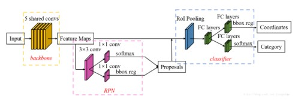
### RPN网络
RPN网络通过在共享特征图上滑动的窗口为每一个像素点生成面积、比例为预定值的目标框，称之为anchor，通过Softmax层判断每一个anchor是前景还是背景，接着利用bboxreg层对判定为前景的anchor进行坐标修正。（这里是对anchor坐标的第一次修正）。最后输出候选目标区域Proposal。 
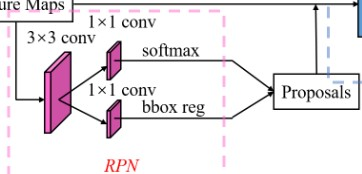
### Classifier
候选目标区域Proposal与共享特征图一同送入Classifier。Classifer的结构与RPN类似，但是多了一个RoI Pooling层。RoI Pooling是一种特殊的池化层用于从共享特征图中提取Proposals的特征，并送入全连接层分类。接着Softmax层判断Proposal具体为哪一类别的事物。bboxreg对anchor坐标的第二次修正。最后输出图片上目标的种类（Category）和坐标(Coordinats)。 
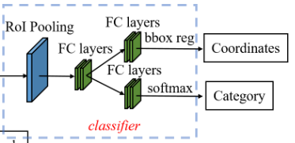
### Faster-RCNN处理图片的完整流程
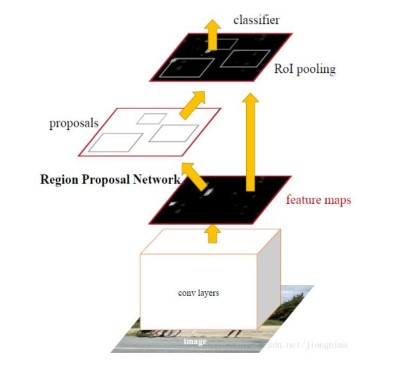
### 最终定位效果
可以对易受环境颜色干扰的车牌和新能源车牌粗略定位 
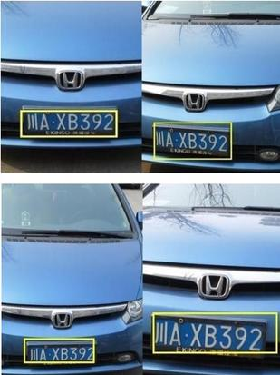 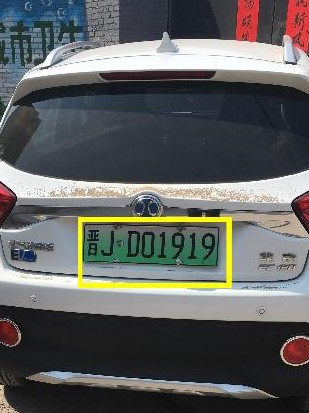 
***由于网络文件较大，获取请移步：[百度云链接](https://pan.baidu.com/s/1ivUqZC3dtqKCw75f2MkFPw)  提取码：q83s ***
# 倾斜矫正
由于拍摄角度的问题，定位之后车牌会有所倾斜，需要进一步矫正，如下图 
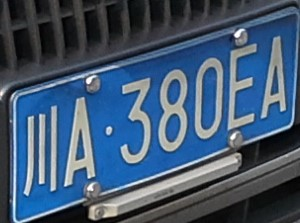 
倾斜分为水平倾斜与竖直倾斜。相应的解决办法包括radon变换与垂直错切，效果如下 
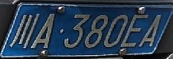   
# 分割
## 去除水平边框
矫正后的车牌留存着边框，可能会影响字符的分割。可以通过将图像二值化后，统计每一行的跳变，将跳变次数小于10的判定为水平边框去除之
## 垂直投影倒序分割
通过垂直投影倒序分割的方法对车牌进行字符分割，效果如下 
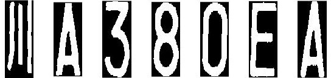 
# 识别
分别用了两个卷积神经网络识别车牌中的数字字母与汉字。 
卷积神经网络结构以及处理图片的流程如下： 
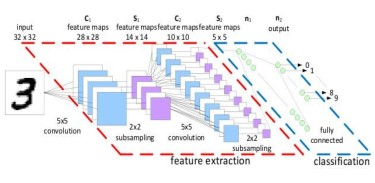 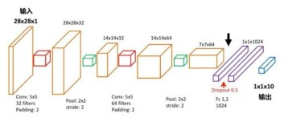 
具体的特征提取，分类识别的原理不再赘述，自行学习，资料海量 
最终的识别效果如下： 
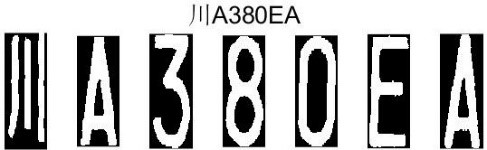
# 结语
测试了165张图片，定位全部正确，但是矫正分割存在问题(共4张)，欢迎补充:blush::blush::blush::blush: 在复杂环境下，定位分割识别正确率97.6% 测试详情请见：[百度云链接](https://pan.baidu.com/s/1nzjw0sz39cccaGn9IwyBWg) 提取码：ct8q  
[回到顶部](#readme)
